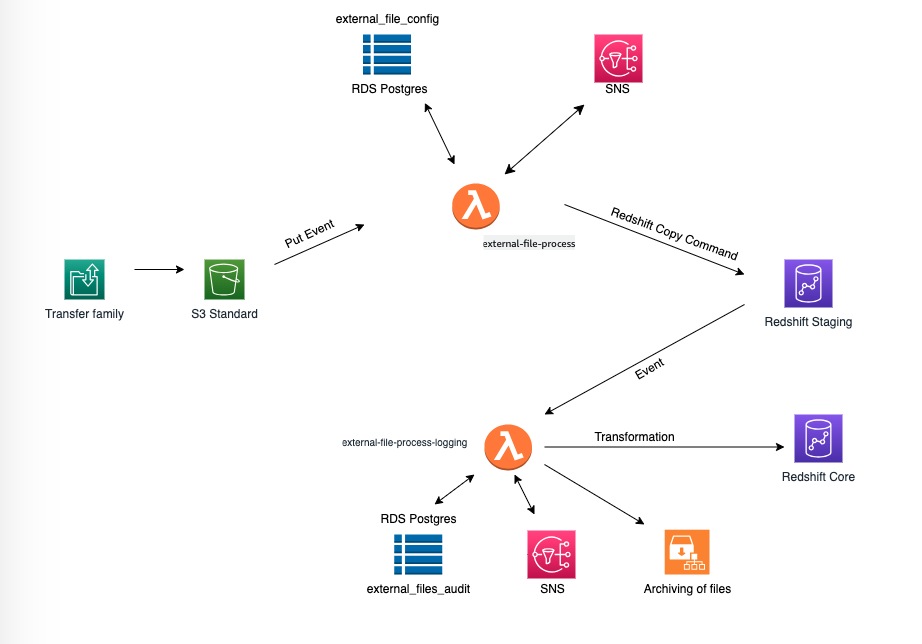

# README #

### Architecture ###

### Introduction ###

This external file framework is running Lambda from S3 put event and fetching configuration for that particular file to check which table to load, preprocessing required or not , header/trailor check, breaking of files into multiple files depending on the configuration. Once it fetches all the info, it does all the preprocessing and prepare automated copy command on the fly and submit to to Redshift via Redshift Data API call and once the process is complete , it will send the event back with status "FINISHED, FAILED, ABORTED"

* external-file-process - This Lambda executes copy command depending on the configuration defined in RDS postgres table rdsftetl.external_file_config. For this, S3 put event pointing to your input S3 bucket is required.

* external-file-process-logging - This Lambda read the event and log audit information in postgres_config_table passed from environment variable and trigger transformation query.

 

### Pre-requisites ###

* A postgres instance (source) and redshift cluster (Destination) both in available state 

* The Lambda function requires the below set of IAM policies and permissions assigned to the IAM role being utilized. 
  * AWSLambdaBasicExecutionRole
  * SecretsManagerAccessPolicy
  * AmazonRedshiftFullAccess
  * AmazonSNSFullAccess
  * AmazonSNSRole
  * AmazonRedshiftDataFullAccess
  * AmazonRDSFullAccess

* The Lambda implementation requires the package **pg8000-layer.zip** added as a Lambda layer. 
This Lambda layer is required to establish a persistent connection with the Redshift/RDS postres database to get the configuration about files.  The Lambda Layer defined in seperate repository 

<b> Note: </b>
- As part of solution you will deploy two lambdas (external-file-process-logging and external-file-process), make sure both of them have same role attached, this is required to check status of Redshift Query statment 
- Make sure Lambda is able to establish persistent connection with source(postgres) and destination(Redshift), Amazon SNS, AWS SecretsManager and Amazon S3 </b>
 References: 
https://repost.aws/knowledge-center/sns-topic-lambda  
https://repost.aws/knowledge-center/lambda-secret-vpc  
https://docs.aws.amazon.com/redshift/latest/mgmt/security-private-link.html  
https://docs.aws.amazon.com/lambda/latest/dg/configuration-vpc-endpoints.html  

#### Environment Variables ####

* secret_postgres --> It needs to have Postgres Secret ARN.

* secret_redshift -->  It needs to have Redshift Secret ARN.

* sns_topic_arn --> It needs to have SNS topic arn

* postgres_config_audit_table --> Configuration table for all files (ForEg: RDSCNFG.EXT_FILE_AUDIT )

* postgres_config_table --> Configuration table for all files (ForEg: RDSCNFG.EXT_FILE_CONFIG )

* iam_role  --> It needs to have IAM Role to run copy command with S3 and Redshift Full permission and role attached to Redshift Cluster.

* archive_folder  --> Folder name inside bucket for archiving.

* processing_folder --> Folder name inside bucket for preprocessing (ForEg: processing) 

* region  --> Value depicts which region to work in (For Eg: ap-south-1)

* custom_error_msg  --> Custom error message can be passed here.

* threshold_file_size_bytes  --> 50

* timezone  --> Asia/Calcutta

#### Logging ####

If the Lambda function runs into any issues, please check the Lambda function logs from CloudWatch.

To directly navigate to function logs using the Lambda console:

*  Open the Functions page of the Lambda console.
*  Choose a function.
*  Choose Monitor.
*  Choose View logs in CloudWatch.

#### Process Flow ####

* external_file_processing_framework.py  --> This is the main python execution file which is the starting point of the code. It used multiple functions to do all the processing which is present in below common lib path.
* lib/common_processing.py --> This python file contains all the functions required to do the processing which is getting called from above main file with parameters

#### Notification process ####

* This framework is sending notification for success and failure to SNS whose arn is passed in environment variable (sns_topic_arn).
* Whoever wants to receives notification from this framework can subscribe to this SNS topic from SNS service console once.

#### Process Flow ####
1. Create RDS, Redshift clusters
2. Establish connection to RDS and Redshift from your SQL Client
3. Execute RDS DDL SQLs
4. Execute RDS DML SQLS
5. Execute Redshift Schema SQLs
6. Execute Redshift Orchestration SQLs
7. Execute Redshift Core, Stage and Error DDLs
8. Execute Redshift DMLs
9. Create a S3 bucket with two folders<i> external_input</i> and <i>archive</i>
10. Create S3 put event for lambda <i> external-file-process </i> pointing to your input S3 bucket for path external_input. 
11. Create event bridge pattern using <i>Orchestration/Event Bridge Pattern/Event_bridge.json</i>
Reference: https://docs.aws.amazon.com/eventbridge/latest/userguide/eb-event-patterns.html#eb-create-pattern
12. Upload sample file in S3(This would trigger required Lambdas and start the process)

